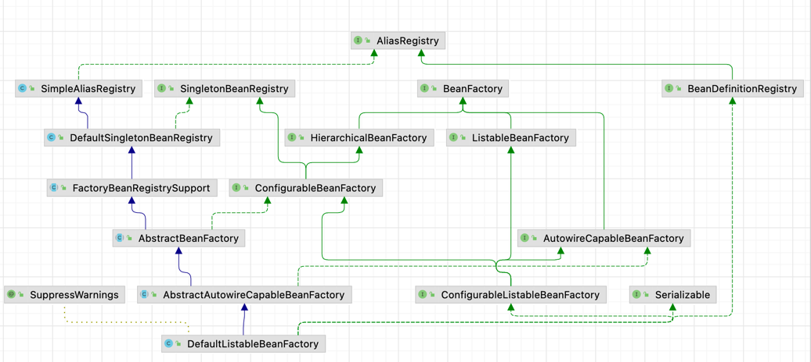
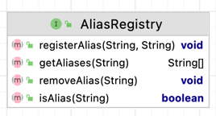
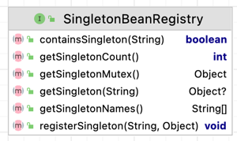

DefaultListableBeanFactory
------



AliasRegistry
------




SimpleAliasRegistry:
------

以map实现AliasRegistry

```java
/**
 * Simple implementation of the {@link AliasRegistry} interface.
 * <p>Serves as base class for
 * {@link org.springframework.beans.factory.support.BeanDefinitionRegistry}
 * implementations.
 */
public class SimpleAliasRegistry implements AliasRegistry {
    /** Map from alias to canonical name. */
    private final Map<String, String> aliasMap = new ConcurrentHashMap<>(16);
}
```

SingletonBeanRegistry
------
Interface that defines a registry for **shared bean instances** (singleton instance).

